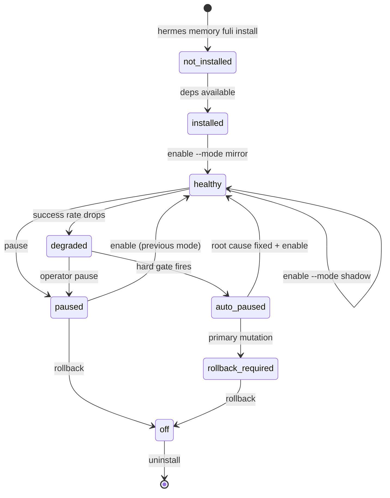

# Fuli Memory for Hermes — Integration Boundary and Architecture

## 1. Commit Classification (integration/fuli-v0.18.2 vs main merge-base)

### 1.1 Product runtime (must land in v0.1.0)

| Commit | Message | Where it lives now | Product boundary target |
|---|---|---|---|
| `c65b381a0` | fix(shadow): move sampled comparisons off foreground request path | `pilot/comparison_executor.py` | `fuli_product/executor.py` + `plugins/memory/shadow/` |
| `046bdfb09` | fix(shadow): generate unique comparison IDs and reject silent collisions | `pilot/comparison_store.py` | `fuli_product/store.py` |
| `e6223cc41` | feat(shadow): persist deterministic sampled-read comparisons | `pilot/comparison_store.py`, `pilot/comparison_metrics.py`, `pilot/sampling.py` | `fuli_product/store.py`, `fuli_product/metrics.py`, `fuli_product/sampling.py` |
| `ba91d8b83` | feat(shadow): add disagreement adjudication workflow | `pilot/comparison_store.py` | `fuli_product/store.py`, `fuli_product/evaluation/` |
| `b10a15d05` | fix(shadow): classify real Fuli timeout envelopes | `pilot/comparison_executor.py` | `fuli_product/executor.py` |
| `b4f10dec3` | fix(shadow): correct timeout detection and persistence invariant | `pilot/comparison_executor.py` | `fuli_product/executor.py` |
| `b366dd488` | fix(shadow): recycle comparison admission capacity after completion | `pilot/comparison_executor.py` | `fuli_product/executor.py` |
| `bbd4f6b83` | feat(shadow): add in/out telemetry contract for foreground timing | `plugins/memory/shadow/__init__.py` | `plugins/memory/shadow/__init__.py` |
| `9fe1339ae` | Align Fuli/shadow adapter with P0 reliability contract | `plugins/memory/shadow/__init__.py`, `plugins/memory/fuli/__init__.py` | `plugins/memory/shadow/`, `plugins/memory/fuli/` |
| `40cd1dff0` | fix(pilot): reject false-green runs when primary is unavailable | `pilot/primary_classifier.py` | `fuli_product/health.py` |
| `2bf8dcbf8` | feat(pilot): add CLI flags for primary-health gate thresholds | `pilot/primary_classifier.py` | `fuli_product/health.py` |

### 1.2 Generic Hermes improvement (land separately, not product-specific)

| Commit | Message | Why it is generic |
|---|---|---|
| `bc1d184ce` | fix(dashboard): use pre-built web dist by default; require --rebuild to force npm | Dashboard build behavior, not memory. Already in mainline. |

### 1.3 Pilot / qualification tooling (kept as scripts, not core product)

| Commit | Message | Rationale |
|---|---|---|
| `e2bc23bfb` | test(shadow): add pre-launch dry-run and Fuli latency probe | `scripts/` remain operator tooling, not runtime. |
| `4dcdfb760` | docs(shadow): document P1 evidence collection | Documentation, not runtime. |
| `1c4e008eb` | test(shadow): commit reproducible live qualification driver | `scripts/p1_qualify_live_15min.py` is soak tooling. |
| `9054f46f4` | fix(driver): include content_captured in run-scoped SELECT | Driver script fix. |
| `d0db85930` | docs(shadow): record P1 live qualification evidence | Evidence doc. |
| `40e31fc1f` | docs(shadow): record v4 outcome detail + operator enablement section | Evidence doc. |
| `99918b54d` | feat(shadow): add checkpointed controlled soak operation | Soak driver script. |
| `5f86ab547` | docs(shadow): record controlled-soak admission-capacity failure | Evidence doc. |
| `cfb9535cd` | fix(capacity-qual): use real post-run accounting for GO/NO-GO gate | Capacity qualification driver script. |

### 1.4 Tests

| Commit | Message | Target |
|---|---|---|
| `ce3f8a1ee` | test(shadow): cover P1 comparison safety and accounting | `tests/fuli_product/` |
| `2b1d98bae` | test(shadow): prove bounded comparison executor and latency isolation | `tests/fuli_product/test_executor.py` |
| `45e62bba1` | test(shadow): add 300-job recycling + submit-failure regression tests | `tests/fuli_product/test_admission.py` |

### 1.5 Documentation

| Commit | Message | Target |
|---|---|---|
| `c7bf632e3` | docs(ops): pin Fuli-Memory-Core P0 baseline for integration | `docs/product/fuli-provider-pin.md` |
| `3b9290924` | docs(ops): controlled Mac mini cutover plan for Fuli/shadow integration | `docs/product/cutover-plan.md` |
| `d837ee575` | docs(shadow): clarify executor and persistence queue boundedness | `docs/product/fuli-memory-product-spec.md` |
| `e9ea4524a` | docs(shadow): correct P1 latency and lifecycle guarantees | `docs/product/fuli-memory-product-spec.md` |

### 1.6 Runtime evidence (must remain untracked)

All `reports/`, `*.db`, driver logs, and checkpoint JSON files produced during the soak. These are never committed.

## 2. Proposed Package Boundary

```text
hermes-agent/
├── plugins/memory/fuli/              # Fuli MemoryProvider (existing, no core changes)
│   ├── __init__.py
│   ├── plugin.yaml
│   └── README.md
├── plugins/memory/shadow/             # Shadow MemoryProvider (existing)
│   ├── __init__.py
│   ├── plugin.yaml
│   ├── shadow_store.py
│   └── README.md
├── plugins/memory/fuli_product/       # NEW: productized orchestration (optional plugin)
│   ├── __init__.py
│   ├── plugin.yaml
│   ├── lifecycle.py                   # mode transitions, install, pause, rollback
│   ├── config.py                      # schema, validation, migration, atomic writes
│   ├── health.py                      # health checks, primary classifier, status model
│   ├── reporting.py                   # status --json, report, export
│   ├── rollback.py                    # rollback to previous provider
│   ├── compatibility.py               # Hermes/Fuli version checks
│   └── migrations.py                  # comparison DB schema migrations
├── hermes_cli/subcommands/memory_fuli.py   # NEW: CLI commands
├── tests/fuli_product/                # NEW: product tests
│   ├── test_lifecycle.py
│   ├── test_config.py
│   ├── test_executor.py
│   ├── test_admission.py
│   ├── test_health.py
│   ├── test_reporting.py
│   ├── test_rollback.py
│   ├── test_compatibility.py
│   └── test_evaluation.py
├── fuli_product/                      # NEW: standalone product library (imported by plugin)
│   ├── __init__.py
│   ├── config.py
│   ├── lifecycle.py
│   ├── health.py
│   ├── executor.py
│   ├── store.py
│   ├── metrics.py
│   ├── sampling.py
│   ├── reporting.py
│   ├── rollback.py
│   ├── compatibility.py
│   └── evaluation/
│       ├── __init__.py
│       ├── corpus.py
│       ├── adjudication.py
│       └── stratification.py
├── docs/product/
│   ├── fuli-memory-product-spec.md
│   ├── hermes-upgrade-impact.md
│   ├── compatibility-matrix.md
│   └── release-notes-v0.1.0-rc1.md
└── reports/product/
    └── compatibility-matrix.json
```

## 3. Provider Protocol

The core Hermes runtime depends only on the existing `MemoryProvider` ABC. Fuli-specific dependencies are lazy-loaded inside the Fuli provider. Generic Hermes code must not import `fuli`, `pilot`, or `fuli_product` directly.

```python
class MemoryProvider(ABC):
    @property
    @abstractmethod
    def name(self) -> str: ...

    @abstractmethod
    def is_available(self) -> bool: ...

    @abstractmethod
    def initialize(self, session_id: str, **kwargs) -> None: ...

    def system_prompt_block(self) -> str: ...
    def prefetch(self, query: str, *, session_id: str = "") -> str: ...
    def get_tool_schemas(self) -> List[Dict[str, Any]]: ...

    @abstractmethod
    def handle_tool_call(self, tool_name: str, args: Dict[str, Any], **kwargs) -> str: ...

    def shutdown(self) -> None: ...
    def backup_paths(self) -> List[str]: ...
    # optional hooks: on_turn_start, sync_turn, on_session_end, etc.
```

Product-specific observability is layered through an optional `capabilities()` method on the provider and a `MemoryProviderObserver` ABC:

```python
class MemoryProviderObserver(ABC):
    @abstractmethod
    def health(self) -> ProviderHealth: ...

    @abstractmethod
    def accounting(self) -> Dict[str, Any]: ...

    @abstractmethod
    def flush(self, timeout_seconds: float) -> bool: ...
```

The shadow provider implements `MemoryProviderObserver` behind a feature check (`hasattr(provider, "observer")`) so generic Hermes code remains unchanged.

## 4. Lifecycle States



## 5. Lazy-Loading Guarantees

- `plugins.memory.load_memory_provider("fuli")` returns an instance without importing `fuli` internals.
- `FuliMemoryProvider.is_available()` checks only whether `fuli` can be imported; it does not create embedders or databases.
- `FuliMemoryProvider.initialize()` with `lazy_init=True` does not build the provider until the first tool call.
- `fuli_product` is imported only when a shadow/fuli mode is configured.
- Hermes boots and runs normally when `fuli` is not installed because the active provider is still Honcho or builtin.

## 6. No Core Coupling

- No changes to `agent/run_agent.py`, `gateway/run.py`, `agent/tool_executor.py`, or desktop UI code for the product runtime.
- The CLI is added via `hermes_cli/subcommands/memory_fuli.py` and registered in `hermes_cli/main.py` with a minimal one-line hook.
- The provider config panel in the desktop app can display `memory.fuli_product` fields generically because they are part of `config.yaml`.

## 7. Migration Boundary

Legacy configs:

```yaml
memory:
  provider: shadow
  shadow:
    primary_provider: honcho
    secondary_provider: fuli
    mirror_writes: true
    compare_reads: true
    sample_rate: 0.05
    ...
```

are migrated to:

```yaml
memory:
  provider: shadow
  fuli_product:
    schema_version: 1
    mode: shadow
    primary_provider: honcho
    secondary_provider: fuli
    mirror_writes: true
    compare_reads: true
    sample_rate: 0.05
    ...
```

The old `memory.shadow` block is preserved in a backup but no longer read by the product. Migration is dry-runnable and idempotent.

## 8. Test Strategy

| Test | Where | Purpose |
|---|---|---|
| Unit tests for executor | `tests/fuli_product/test_executor.py` | boundedness, timeouts, privacy, admission |
| Unit tests for config | `tests/fuli_product/test_config.py` | schema validation, migration, atomic writes |
| Unit tests for lifecycle | `tests/fuli_product/test_lifecycle.py` | mode transitions, pause, rollback |
| Health tests | `tests/fuli_product/test_health.py` | primary classifier, gates, status model |
| Compatibility tests | `tests/fuli_product/test_compatibility.py` | Hermes/Fuli version checks, no-Fuli boot |
| Reporting tests | `tests/fuli_product/test_reporting.py` | JSON schema, redaction, export |
| Evaluation tests | `tests/fuli_product/test_evaluation.py` | corpus, adjudication, stratification |
| E2E smoke | `tests/fuli_product/test_e2e_smoke.py` | temp HERMES_HOME, fake providers, install/rollback |
